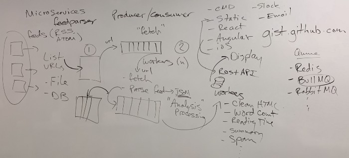

# Architecture

Telescope is both a product and a project. It is designed to meet a number of practical requirements (e.g., blog aggregation), but also to give students the opportunity to work on a real-world open source project using a wide range of technologies. We could build something simpler; but our design is also about creating a safe space for technical exploration. As a result, Telescope is architected like many modern distributed services.

## Initial Design

Our initial design was captured in this rough diagram:

It shows RSS/Atom blog feeds (on the left) being downloaded (1) and then queued (2) in order to be downloaded and parsed into a database. Parsing each feed also included the idea of analysis, to look at word count, reading time, etc. This database of parsed feeds is then exposed to various clients via a REST API. We imagined being able to provide multiple clients, written for the web or mobile, but also connecting to Slack and other systems.

## Current Design

The following gives an overview of the current (i.e. 2.4.0) design of Telescope. There are a number of major systems that make up the app:

- legacy monolithic back-end (1.0)
- back-end microservices (2.0)
- front-end web app
- SAML2-based authentication and authorization
- autodeployment server
- test, build, and other automation tooling

### Legacy Monolithic Back-end (1.0)

Telescope's back-end began as a single, monolithic node.js app. During the 2.0 release, much of the back-end was split into separate microservices (see below). However, parts of the legacy back-end code are still in use, see `src/backend/*`.

The current system uses the legacy backend in order to run the feed parser and feed queue, see `src/backend/feed/*`. The processed feeds and posts are then stored in Redis (cache) and Elasticsearch (indexing) databases, and various microservices use these in order to get their data.

Telescope's data model is built on Feeds and Posts. A feed represents an RSS/Atom feed, and includes metadata about a particular blog (e.g., URL, author, etc) as well as URLs to individual Posts. A Post includes metadata about a particular blog post (e.g., URL, date created, date updated, etc).

The legacy back-end is started using `pnpm start` in the root of the Telescope monorepo, and it (currently) must be run alongside the microservices. When it runs, the logs show information about feeds being parsed in real-time, which continues forever.

The parser downloads the [CDOT Feed List](https://wiki.cdot.senecacollege.ca/wiki/Planet_CDOT_Feed_List#Feeds), parses it, creates `Feed` objects and puts them into a queue managed by [Bull](https://github.com/OptimalBits/bull) and backed by Redis. These are then processed in `src/backend/feed/processor.js` in order to download the individual Posts, which are also cached in Redis.

There is code duplication between the current back-end and the Parser microservice (see `src/api/parser`), and anyone changing the back-end will also need to update the Parser service at the same time (for now). One of the 3.0 goals is to [remove the back-end and move all of this logic to the Parser service](https://github.com/Seneca-CDOT/telescope/issues?q=is%3Aissue+is%3Aopen+parser+service).

In production, the legacy back-end is deployed as a container named `telescope` (see `docker/production.yml`), and its Dockerfile lives in the root at `./Dockerfile`.

### Back-end Microservices (2.0)

The legacy back-end has been split into a series of microservices. Each microservice follows a similar architectural pattern and has a single focuses. The current microservices include:

- Auth Service (`src/api/auth`) - authentication and authorization
- Feed-Discovery Service (`src/api/feed-discovery`) - blog feed discovery and validation
- Image Service (`src/api/image`) - dynamic image generation for the front-end hero banner
- Planet Service (`src/api/planet`) - recreation of the original CDOT Planet using Telescope's back-end
- Posts Service (`src/api/posts`) - API for accessing Post and Feed data in Redis (probably not well named at this point)
- Search Service (`src/api/search`) - API for doing searches against Elasticsearch
- Status Service (`src/api/status`) - API for accessing Telescope status information, as well as providing the Dashboards
- Users Service (`src/api/users`) - API for interacting with the Users data (currently in Firebase)
- Parser Service (`src/api/parser`) - feed and post parsing. Currently disabled, see <https://github.com/Seneca-CDOT/telescope/issues/2111>

All microservices are built on a common foundation, the [Satellite module](https://github.com/Seneca-CDOT/satellite). Satellite provides a common set of features for building Express-based microservices, with proper logging, health checks, headers, authorization middleware, as well as connections to Redis and Elasticsearch. It saves us having to manage the same set of dependencies a dozen times, and repeat the same boilerplate code.

The microservices are deployed as Docker containers. Each defines its own `Dockerfile`, and the entire system is managed via `docker-compose`, see `src/docker`, where we have a base service definition in `src/docker/docker-compose.yml` as well as overrides for various environments: `development.yml` (local dev), `production.yml` (staging and production), and `gitpod.yml` (running Telescope in GitPod). Each of these service definitions uses an associated environment file, which are defined in `src/config`. For example, Telescope's production server uses the `src/docker/production.yml` file and `src/config/env.production` environment.

When deployed, the services are not directly accessible via the network (i.e. you can't go to localhost:5555 to access the server). Instead, you have to access them via an API gateway called Traefik, which also runs in its own container. Traefik lives at api.telescope.cdot.systems (production), dev.api.telescope.cdot.systems (staging), and localhost:80 (development). It provides routing to each of the service containers via labels defined in the `src/docker/docker-compose.yml` file. For example, the Image Service is available at `/v1/image`. In production you access it at <https://api.telescope.cdot.systems/v1/image>, in staging at <https://dev.api.telescope.cdot.systems/v1/image>, and locally at <http://localhost/v1/image>. The other services are similar. Traefik makes the different services look like one thing, but they are actually deployed and running separately.

The microservices can be controlled either using the `docker-compose` command directly, or with the following `npm` scripts:

- `pnpm run services:start` starts all services. You can also list one or more services to start a subset, `npm run services:start image planet`
- `pnpm run services:stop` stops all services, or those specified
- `pnpm run logs image` shows logs for the image service (specify whichever service you want to view)

On Windows and macOS, Docker Desktop must be running before you can call these scripts, see the [Docker documentation](docker.md).

### Front-end Web App

The front-end web app is written in TypeScript and uses next.js and Material UI for routing, component system, etc. The code lives in `src/web`.

The web app accesses many of the microservices at runtime, and we depend on a build step to export and include the necessary runtime variables. In the front-end app, they are available at runtime via `src/web/src/config.ts`. These are populated via the `src/web/next.config.js` during build time. See [Environment Setup](environment-setup.md) for details on how to populate these with different values for local, CI, staging, or production environments. See also [Front End](front-end.md) for more details about the front-end.

The front-end is run via its own container, and hosted statically by nginx. The container is defined in `src/web/Dockerfile`. Locally, it is available at <http://localhost:8000>, on staging at <https://dev.telescope.cdot.systems/>, and on production at <https://telescope.cdot.systems/>.

### SAML2-based authentication and authorization

Telescope uses SAML2-based authentication via Seneca's Single Sign-On in combination with token-based authorization via the Auth and Users service. A good discussion of the main ideas and implementation is available in [this blog post](https://blog.humphd.org/not-so-simple-saml/) and [this Pull Request](https://github.com/Seneca-CDOT/telescope/pull/1796#issue-812477759).

In development, we use a test PHP-based SAML Identity Provider to test against. See [Login](login.md).

### Autodeployment Server

Our release infrastructure is built primarily on GitHub Actions, see `.github/workflows/release.yml`. However, we also host our own build service at `tools/autodeployment`. When a [Release is created](release.md), the autodeployment server receives a webhook event from GitHub. We use this to trigger a new build and deploy it when complete. The build script that gets run is at `tools/autodeployment/deploy.sh`, which does a green/blue style of deployment (i.e., keep one version running while you build a new one, swap them when ready).

The autodeployment server is run outside of Docker, since it manages our docker containers. It has an API available at <https://telescope.cdot.systems/deploy/status> (production) and <https://dev.telescope.cdot.systems/deploy/status> (staging), and build logs are available at `/deploy/status/log`.

### Dashboards

The Status service provides a number of real-time dashboards. These are available at <https://api.telescope.cdot.systems/v1/status> (production) and <https://dev.api.telescope.cdot.systems/v1/status> (staging).

The Dashboards intentionally do not use React, next.js, or other technologies from the normal front-end. This was done in order to provide students who don't want to work on React a place to contribute. Instead, it uses plain HTML, SCSS/CSS, and JavaScript, and uses server-side rendering with Express. It also uses a variety of front-end DOM code written in JavaScript.

The Status service uses this Autodeployment API to show a live build log, for example: <https://api.telescope.cdot.systems/v1/status/build> on production, <https://dev.api.telescope.cdot.systems/v1/status/build> on staging.

### Test, Build, and other Automation Tooling

We use the following tools:

- pnpm to manage packages within our monorepo, see `pnpm-workspace.yaml`
- jest (unit, snapshot) and Playwright (e2e) to write and run tests. We define configs (see `./jest*.js`) in the root of the project, and use/override them in sub-folders. Our tests are in `test/` and also in `test/` folders deeper in the tree
- eslint to lint our code, see `.eslintrc.js` and `.eslintignore`
- prettier to format our code, with Husky managing a precommit hook to automatically apply it on every commit, see `.prettierrc`, `.prettierignore`, and `.husky/`
- various VSCode settings and extensions, defined in `.vscode/`
- GitHub Actions Workflows for testing, see `.github/`
- Renovatebot to manage dependency updates, see [Renovate](renovate.md)
- GitPod for cloud development, see [Gitpod](git-workflow.md), `.gitpod.yml` and `gitpod.Dockerfile`

We also have a number of tools running in containers at runtime (most only in staging/production) (see `docker/production.yml`):

- nginx, which we use to host static web sites and also as a reverse proxy for node APIs. Our nginx configs are built from a template that lives in `./config/nginx.conf.template`
- certbot, which manages our Let's Encrypt SSL Certificates (i.e., automatically renewing them)
- logrotate, to keep our log files from filling the staging and production server disks
- portainer, to provide a user-friendly front-end to our main containers at run-time
