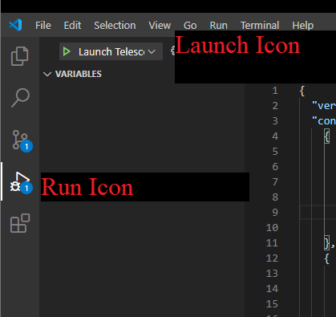
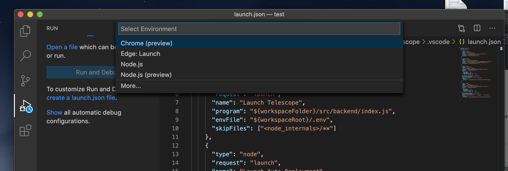
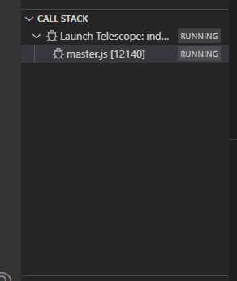
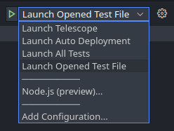
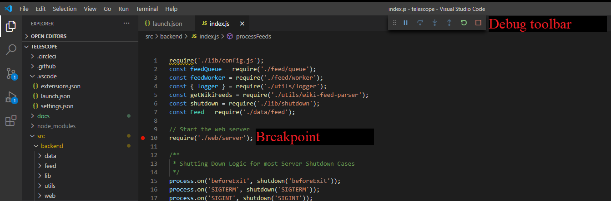
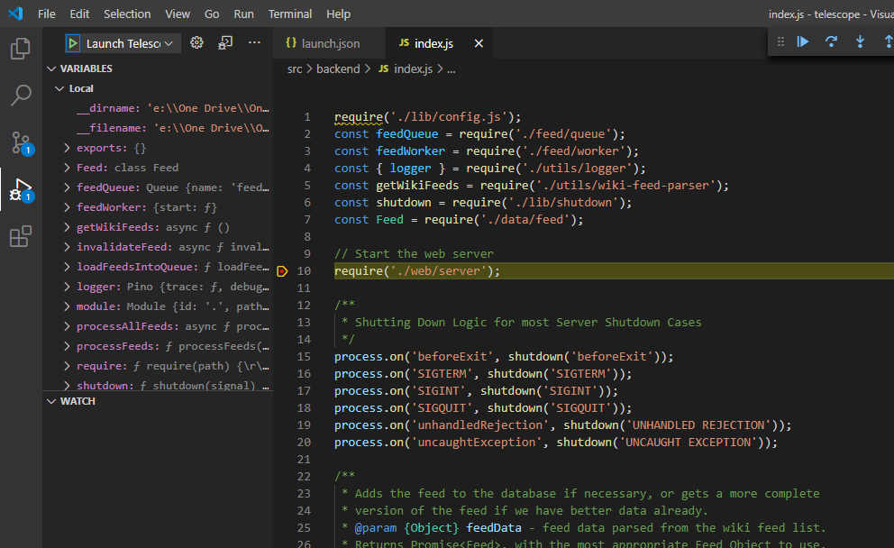
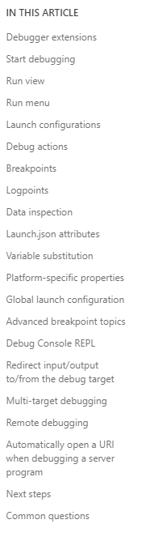

## Debugging Tutorial

### For debugging purposes the following must be installed

[Visual Studio Code](https://code.visualstudio.com/)
[Node.js](https://www.npmjs.com/) - to setup node.js you may follow the instructions in [Environment Setup](https://github.com/Seneca-CDOT/telescope/blob/master/docs/environment-setup.md)

### Setting up VS Code and Launching Telescope

To begin debugging one must select the "Run View" tab. This will display a menu that for debugging purposes.

Visual Studio Code will automatically try to detect the debug environment but in the case that it fails you must select "Node.js".

To start the server you must now click on the "Launch Icon" this will run the server.

At the bottom left you will see your Call Stack and if successfully ran, index.js and master.js should be up and running.

### Debugging

Now that we know how to launch the server. We will look at different launching options :

1. Launch Telescope -> Launches index.js and tries to run the backend.
1. Launch Auto Deployment -> Launches autodeployment found in tools.
1. Launch All Tests -> Runs all the tests in the tests folder.
1. Launch Opened Test File -> Will run a test that is currently opened in a VS code tab.

We may now proceed to debugging.
In this case we will use index.js as an example. When debugging you can set breakpoints (Using F9 or go through toolbar menu Run->Toggle Breakpoint) that will appear as a red dot on the left side of a line. With breakpoints in place, you may now use the Debug toolbar to toggle different debugging options.

Once breakpoints are set and the server is running, you may now view the current state of the system and view variables, functions that are being called, etc.

At the bottom you may also see errors (recognized as problems).

### Features

VS has many features like logpoints. Logpoints is a console tool that allows for messages to be logged without setting a breakpoint.
In addition to that launch.json has many attributes that can make debugging very versatile.
Many more key features of VS can be found on [VS debugging](https://code.visualstudio.com/docs/editor/debugging#_launch-configurations) page. As seen in the screenshot below.

