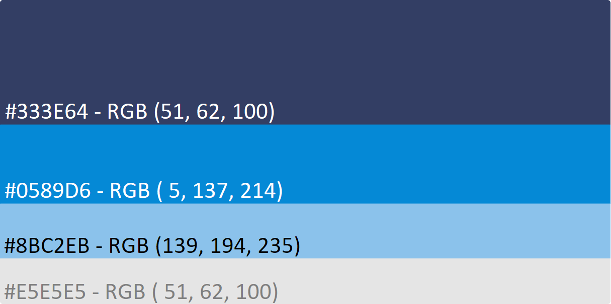

# Frontend Development with Next

The Telescope frontend is currently being developed using Typescript and NextJS. We encourage all new developers to read the [NextJS docs](https://nextjs.org/docs) in order to familiarize themselves with how Next works as well as the [Typescript docs](https://www.typescriptlang.org/docs/) in order to understand how the language operates.

## Design choices

When working on a new component for the Telescope frontend, please consider the following:

- We do not use `React.FC` and `React.FunctionalComponent` when making our components. The reason for this can be found [here](https://github.com/facebook/create-react-app/pull/8177).
- We require all components being created to strictly be exported directly inside the components folder. This is due to the way NextJS serves page requests, where we build our pages in the `pages` folder using the components made in the `components` folder.

## Common examples to consider

- [This link](https://github.com/typescript-cheatsheets/react#reacttypescript-cheatsheets) provides some examples that utilize Typescript with common React activities such as creating components and utilizing React Hooks.
- [This link](https://material-ui.com/guides/typescript/) provides examples on how to utilize Material-UI with Typescript. This will be helpful for those contributing to the styling and theming of Telescope
- [This link](https://github.com/vercel/next.js/tree/canary/examples/with-typescript) provides an example NextJS project, useful to see how a NextJS project works
- [This link](https://github.com/vercel/next.js/tree/canary/examples) provides example cases all utilizing NextJS. Useful for understanding a specific case related to the issue you're currently working on.

## Colour Palette

Here is the colour palette that we use to make our web site looks pretty and up-to-date.



## Palette

 **Primary**

- hex: #333E64
- rgb: (51, 62, 100)

 **Secondary**

- hex: #0589D6
- rgb: (5, 137, 214)

 **Background**

- hex: #E5E5E5
- rgb: (229, 229, 229)

## Typography

 **Primary**

- hex: #181818
- rgb: (24, 24, 24)

 **Secondary**

- hex: #8BC2EB
- rgb: (139, 194, 235)

 **Contrast Text**

- hex: #E5E5E5
- rgb: (229, 229, 229)

“The Free Image Placeholder Service Favoured By Designers.” Placeholder.com, 17 Dec. 2019, placeholder.com/.

<br/>

# Theming

Here is how we construct our Theme with MUI ([frontend/src/web/src/theme/index.ts](https://github.com/Seneca-CDOT/telescope/blob/master/src/web/src/theme/index.ts))

```node
export const lightTheme: Theme = createMuiTheme({
  palette: {
    type: 'light',
    primary: {
      main: '#333E64',
      contrastText: '#E5E5E5',
      light: '#FFFFFF',
    },
    secondary: {
      main: '#0589D6',
    },
    error: {
      main: red.A400,
    },
    background: {
      default: '#E5E5E5',
      paper: '#E5E5E5',
    },
    text: {
      primary: '#181818',
      secondary: '#8BC2EB',
    },
  },
});

export const darkTheme: Theme = createMuiTheme({
  palette: {
    type: 'dark',
    primary: {
      main: '#242424',
      contrastText: '#E5E5E5',
      light: '#FFFFFF',
    },
    secondary: {
      main: '#4f96d8',
    },
    error: {
      main: red.A400,
    },
    background: {
      paper: '#303030',
      default: '#121212',
    },
    text: {
      primary: '#E5E5E5',
      secondary: '#4f96d8',
    },
  },
});
```

## Usage Explanation

1. `primary.main` is used mainly for background color of header, footer, posts' header, banner and search bar's heading
2. `primary.contrastText` is used where we need contrast text on top of `primary.main` color. These include text in header, footer, banner, and text in posts' header about date and author.
3. `secondary.main` is used for the background colour of scroll down and scroll to top buttons.
4. `error.main` is used for displaying error messages
5. `background.default` is used for the main background of the app as well as the content background of posts.
6. `text.primary` is used for the text color of posts' contents and about information text
7. `text.secondary` is used for the title of posts
