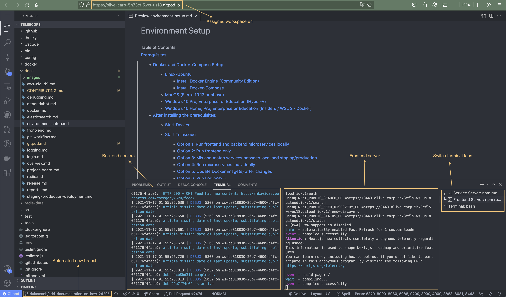

# Development on Gitpod

You can start an automated development environment in the cloud and access it
through your browser.

We have described the environment setup steps to Gitpod in [gitpod.yml](https://github.com/Seneca-CDOT/telescope/blob/master/.gitpod.yml)
which takes care of installing dependencies, building, starting micro-services and
starting the frontend development server for you.

> Gitpod is a container-based development platform that puts developer experience first.
> Gitpod provisions ready-to-code developer environments in the cloud accessible through your browser

[Learn more about Gitpod](https://www.gitpod.io/docs)

## Gitpod Pricing

Gitpod gives each account 50 hours for free per month. When free hours run out, you can
still keep working on your open workspaces but new workspaces can't be created.

If you enjoy the experience, you can upgrade to Gitpod student plan without needing a credit card.

|                     | Free              | Student Unleashed |
| ------------------- | ----------------- | ----------------- |
| Repository          | Public && Private | Public && Private |
| Workspaces hours    | 50                | Unlimited         |
| Workspace timeout   | 30 minutes        | 1 + 3 boost hours |
| Parallel workspaces | 4                 | 16                |
| Team collaboration  | No                | Yes               |
| Monthly cost        | Free              | $9                |

Learn more about [Gitpod pricing](https://www.gitpod.io/pricing)

## Open a Gitpod workspace

A Gitpod workspace includes everything developers need to be productive: source code, a
Linux shell with root/sudo, a file system, the full VS Code editing experience including
extensions, language support and all other tools and binaries that run on Linux.

1. In a browser, navigate to a Telescope's Github branch, commit, Issue, or PR page.

2. Open in Gitpod:

- Option 1: [Install the Gitpod extension](https://www.gitpod.io/docs/browser-extension) to open the page in Gitpod with a click of a button.
  
- Option 2: In the address bar, prefix the entire URL with `gitpod.io/#` and press Enter,
  E.g, [gitpod.io/#https://github.com/Seneca-CDOT/telescope](https://gitpod.io/#https://github.com/Seneca-CDOT/telescope)

3. To use GitPod, you need to have a Git hosting account such as Github, GitLab or BitBucket.

4. You will see the familiar VSCode in the browser serving Telescope source code:

   

- If you open an Issue, Gitpod automatically checks out a new git branch for you to work on.
- On the first tab of the VScode terminal, the left half is for building and starting
  services, the second half waits for services to start and spins up the Next frontend dev server.
  Switch to the second tab for running terminal commands.
- Each workspace is assigned a unique URL, however, it's not stable because a workspace is considered to be short-lived.

## Gitpod pre-builds

Gitpod continuously builds all Telescope Git branches like a CI server. Whenever the code changes
(e.g. when new commits are pushed to your repository), Gitpod can prebuild workspaces,
i.e. run the init commands in your .gitpod.yml configuration file before you even start a workspace.

## Shut down your workspaces

Within 3 minutes after closing your workspace browser tab, it will be stopped.

Unused workspaces are automatically deleted after 14 days of inactivity.
To prevent a workspace from being deleted, you can pin it in your list of workspaces.
Pinned workspaces are kept forever.

## Resuming workspaces

Navigate to [Gitpod Dashboard](https://gitpod.io/workspaces) to select a workspace to continue
working on.
