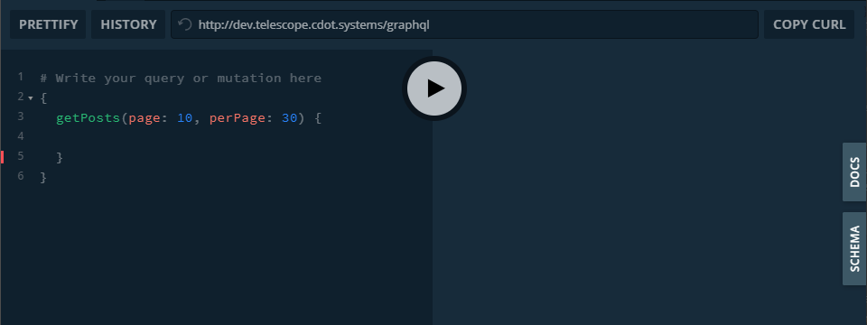
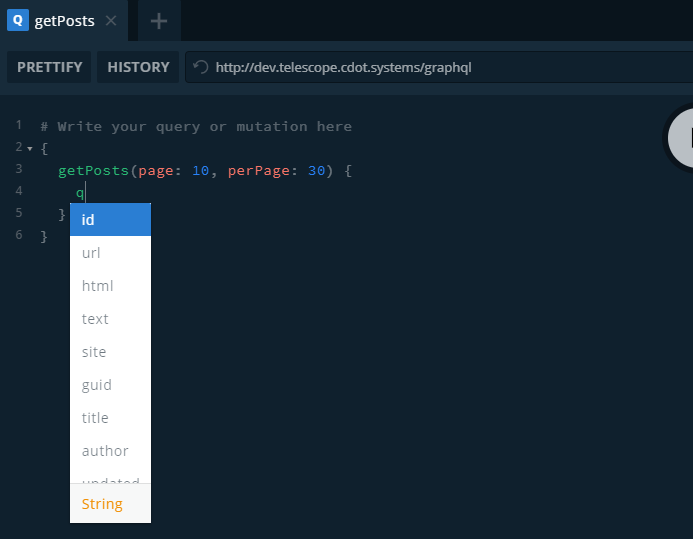
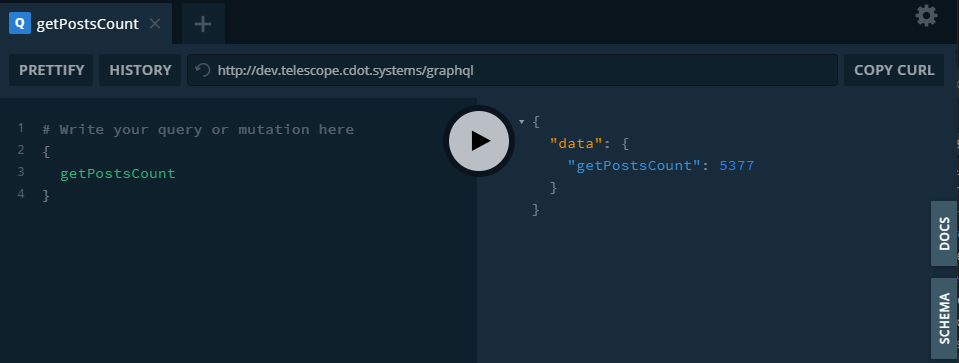
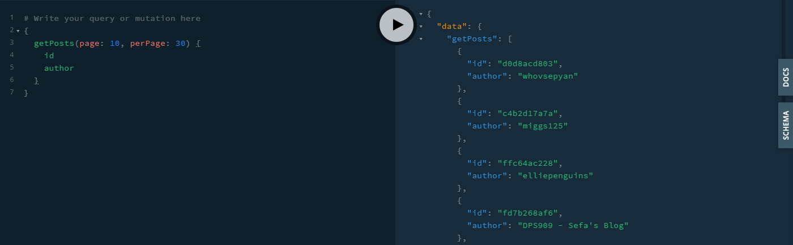
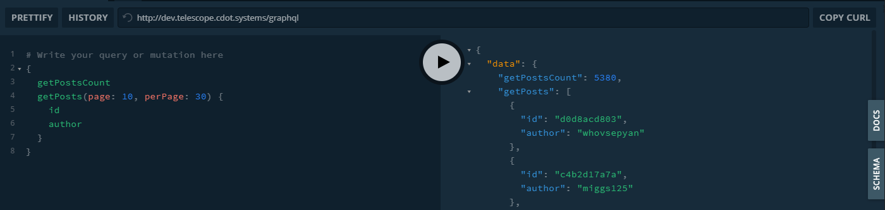

# Using GraphQL

\_Note: If testing this locally, you must have telescope running locally as well. Please refer to the documentation [here](./environment-setup.md)

1. Normal express endpoints return defined data. For example our `GET` endpoint, `/id` defined in [feeds.js](../src/backend/web/routes/feeds.js) returns `{"id": , "author": , "url": }` but what if only the id is needed? Or what if we wanted to get the posts associated with a certain feed? Using REST APIs there would be a `fetch` to get the id of the feed first, then another `fetch` to get all the posts belonging to the feed. This also doesn't scale as well, as more routes may have to be added in the future to support different types of `GET` requests.

1. Using GraphQL we can do all this in one query while also allowing users to specify which fields are to be returned. This is just a quick example, for a more in depth explanation please refer to the official [documentation](https://www.howtographql.com/basics/1-graphql-is-the-better-rest/).

# Adding/Modifying Resolvers for GraphQL

1. Our resolvers can be found in [src/backend/web//graphql/index.js](../src/backend/web/graphql/index.js) under `module.exports.resolvers`.

## Step-by-step Guide

1. To access GraphQL, append /graphql to the end of your local app URI. For example if your Telescope app is running at `http://localhost:3000`, you can access GraphQL for telescope at `http://localhost:3000/graphql`

2. A list of available resolvers for Telescope can be found in `src/backend/web/graphql/index.js` under `module.exports.resolvers`. The list of available resolvers may change over time.

3. We will use the `getPosts` query, this query has two parameters `page` and `perPage`. For example, if a user wanted to see the results of page 10 and have 30 results per page, he/she would type the following:

This query won't run, because we also need to specify query fields. To see some available query fields type q within the `getPosts()` block:

An available list of query fields will be displayed. Otherwise, please check the [definition](https://github.com/Seneca-CDOT/telescope/blob/08c55d4d694cf7b8a2c37b7945606c792976191d/src/backend/web/graphql/index.js#L15)

Some of the available resolvers may not use any parameters in this case, please use resolvers like the following:

The following will let us retrieve the `id` and `author` of all posts on the 10th page of results with 30(Posts) results shown:

More than one query can be combined like the following:

For more information, please refer to the official [Documentation](https://graphql.org/learn/queries/)
