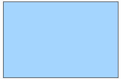
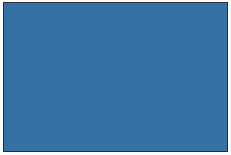
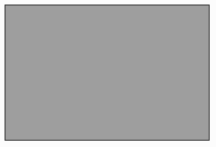

# Colour Palette

Thank you for thinking to contribute to the look of the Telescope. This is a guide to the colour palette that we use to make our web site looks pretty and up-to-date.

|  #FFFFFF, rgb (255,255,255)   | #A4D4FF, rgb (164, 212, 255)  |  #3670A5, rgb (54, 112, 165)  |
| :---------------------------: | :---------------------------: | :---------------------------: |
|  |  |  |

| #9E9E9E, rgb (158, 158, 158)  |   #002944, rgb (0, 41, 68)    |
| :---------------------------: | :---------------------------: |
|  |  |

## Header

 **Title:**

- hex: #A4D4FF
- rgb: (164, 212, 255)

 **Search Icon:**

- hex: #FFFFFF
- rgb: (255, 255, 255)

 **Menu Icons (Home, Login, About):**

- hex: #FFFFFF
- rgb: (255, 255, 255)

## Banner

 **Name, statistics, version:**

- hex: #FFFFFF
- rgb: (255, 255, 255)

## Search Bar

 **Filter name and search icon background:**

- hex: #3670A5
- rgb: (54, 112, 165)

 **Input background:**

- hex: #9E9E9E
- rgb: (158, 158, 158)

 **Magnifying glass icon**

- hex: #002944
- rgb: (0,41,68)

 **Magnifying glass icon background colour:**

- hex: #3670A5
- rgb: (54, 112, 165)

 **Form control:**

- hex: #3670A5
- rgb: (54, 112, 165)

“The Free Image Placeholder Service Favoured By Designers.” Placeholder.com, 17 Dec. 2019, placeholder.com/.
