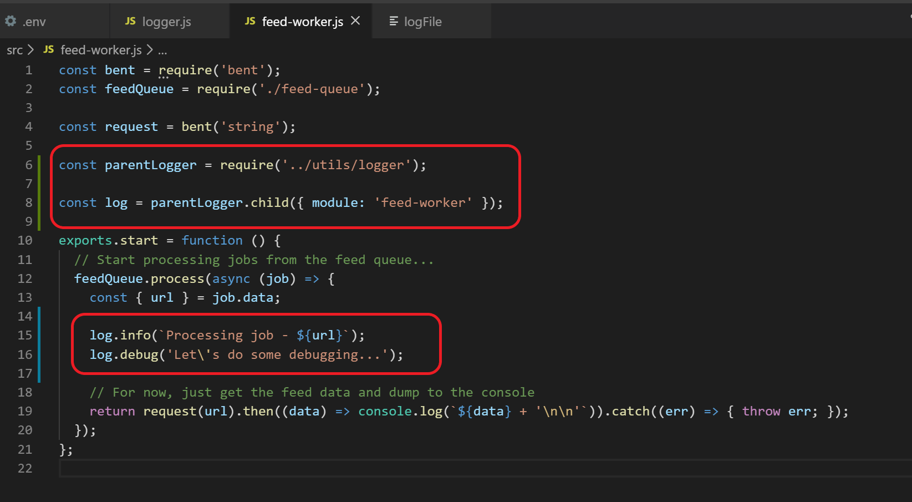
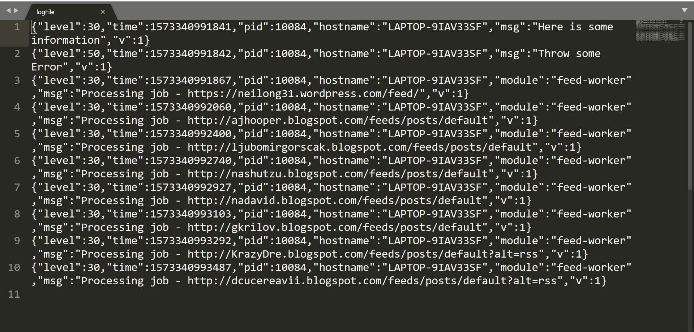
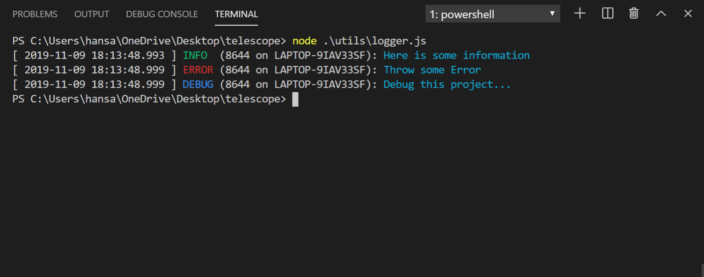

# Logging Support Using Pino

This project uses [Pino](http://getpino.io/#/) to provide support for logging in Production as well as development environments. The [logger.js](../utils/logger.js) module exports a logger instance that can be used in other modules to implement logging for important events.
## How to use the logger

1. In the module, import the parent logger using the require statement at the top of the file.
2. Create a child logger from the parent logger instance and pass the "module" key with the value of your module name.
3. Use the child logger to log important events.

When you’re logging, it’s often handy or even necessary to categorize or sub-categorize the logs so more context can be added to the information that’s logged. Child loggers specialize the parent logger object, effectively adding more context to the information which is logged. For example, let’s say we want to know which module printed a certain log record. To do that, we call the parent’s logger.child method and pass in the new field in the constructor as shown in the code examples below.

```javascript
const parentLogger = require('../utils/logger');
const log = parentLogger.child({ module: 'module-name' });

log.info('Important information...');
```



## Logger Configuration
The properties for the logger instance are configured according to the environment and the log level. The **NODE_ENV** and **LOG_LEVEL** enviroment variables can be set in the **.env** file. Also, the **LOG_FILE** environment variable can specify a file path where the logs will be written (for production mode only).

### Production Environment:
 If **NODE_ENV = Production** (assumed by default), then the code:
 * Defines a new Logger instance.
 * Writes logs to a specified file path ('./logFile').
 * Sets the log level to the LOG_LEVEL environment variable with 'info' as the default level.

 By default, Pino log lines are newline delimited JSON (NDJSON). This is perfect for production usage and long term storage. It's not so great for development environments. Thus, Pino logs can be prettified by using a Pino prettifier module like pino-pretty which is already added as dependency of this project. To view the logs in a more human readable format, use the following command:

```powershell
cat logFile | pino-pretty --translateTime 'SYS: yyyy-mm-dd HH:MM:ss.l '
```
**Generated log file:**


**Log file formatted using pino-pretty:**


### Development Environment:
 If **NODE_ENV = Development**, then the code:
  * Outputs logs to console (which is by default)
 * Enables prettyPrint option and translates time from epoch time to local time.
 * Sets the log level to the LOG_LEVEL environment variable with 'debug' as the default level.

In development mode, logs are formattted using pino-pretty module and are printed to the console (see image below).


