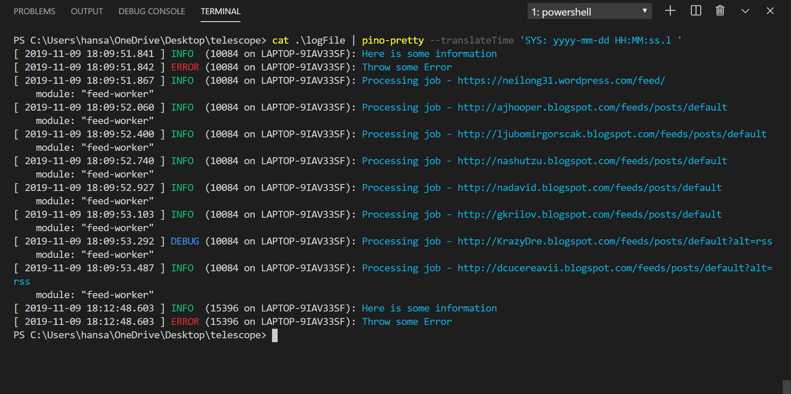

# Logging Support Using Pino

This project uses [Pino](http://getpino.io/#/) to provide support for logging in Production as well as development environments. The [logger.js](../src/backend/utils/logger.js) module exports a logger instance that can be used in other modules to implement logging for important events.

## How to use the logger

```javascript
const { logger } = require('../src/backend/utils/logger');

logger.info('Important information...');
logger.trace('Information About Trace');
logger.debug('Information useful for Debugging');
logger.fatal('Alerting harmful situations');
logger.error('Information about Error Events');
logger.warn('Information about Warning');
logger.error({ error }, 'There was an error doing some operation...');
```

**ALL** All levels including custom levels.
**DEBUG** Designates fine-grained informational events that are most useful to debug an application.
**INFO** Designates informational messages that highlight the progress of the application at coarse-grained level.
**WARN** Designates potentially harmful situations.
**ERROR** Designates error events that might still allow the application to continue running.
**FATAL** Designates very severe error events that will presumably lead the application to abort.
**OFF** The highest possible rank and is intended to turn off logging.
**TRACE** Designates finer-grained informational events than the DEBUG.

## Logger Configuration

The logger object has properties that are configured in the **.env** file. There are three environment variables we are interested are the **NODE_ENV**, **LOG_FILE**, and **LOG_LEVEL**. We can specify a file path where the logs will be written by using the **LOG_FILE** variable (for production mode only). When LOG_FILE is not specified, the logs are written to the console using the pino-pretty option.

### Production Environment:

If **NODE_ENV = Production** or **NODE_ENV is not set**, then the code:

- Defines a new Logger instance.
- If LOG_FILE is set, writes logs to a specified file path ('./logFile') or outputs them to console.
- Sets the log level to the LOG_LEVEL environment variable with 'info' as the default level.

By default, Pino log lines are newline delimited JSON (NDJSON). This is perfect for production usage and long term storage. It's not so great for development environments. Thus, Pino logs can be prettified by using a Pino prettifier module like pino-pretty which is already added as dependency of this project. To view the logs in a more human readable format, use the following command:

```powershell
cat logFile | pino-pretty --translateTime 'SYS: yyyy-mm-dd HH:MM:ss.l '
```

**Generated log file:**


**Log file formatted using pino-pretty:**


### Development Environment:

If **NODE_ENV = Development**, then the code:

- Outputs logs to console (which is by default)
- Enables prettyPrint option and translates time from epoch time to local time.
- Sets the log level to the LOG_LEVEL environment variable with 'debug' as the default level.

In development mode, logs are formatted using pino-pretty module and are printed to the console (see image below).


