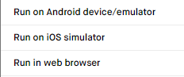
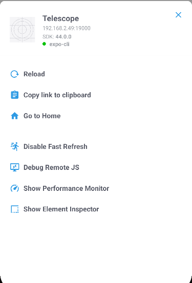

# React Native

## Installing React Native Expo

We use [Expo](https://expo.dev/) to help us develop our application. Install the command line tool so you can run Expo commands.

```
npm install -g expo-cli
```

## Running the application

Open `Metro Bundler` (deployment server) for testing and deployment purposes.

```
cd src/mobile
pnpm start
```

`Metro Bundler` gives you the chance to test our application on an `Android` simulator, `iOS` simulator, `web` or on a real device.



Testing on `iOS` requires `macOS` and [Xcode](https://developer.apple.com/xcode/).
On the other hand, [Android Studio](https://developer.android.com/studio?gclid=Cj0KCQiAuvOPBhDXARIsAKzLQ8HSP0n1tojsRjsEZhT2cWmUrps8u4oND0eAONViZsf9rqMk2gFpc_waAtJOEALw_wcB&gclsrc=aw.ds) provides virtual `Android` machine for testing purposes. Learn how to set up [Android Studio](https://docs.expo.dev/workflow/android-studio-emulator/) and [xCode](https://docs.expo.dev/workflow/ios-simulator/) properly for development.

In `Metro Bundler`, you can choose to generate a `QR` code with the `tunnel` connection to have the app running on your physical device.


Note: For `macOS` more [configuration](https://docs.expo.dev/workflow/android-studio-emulator/) is needed if you want to use `Android Studio` to test the application

## Debugging

To bring up the developer menu:



- On `Android` virtual machine: Cmd ⌘ + M or Ctrl + M
- On `iOS` virtual machine: Cmd ⌘ + D (on `iOS` sometimes you will have to use Ctrl + D then Cmd ⌘ + D) or Ctrl + D
- On physical devices: shake your device

Click on `debug remote JS` and then you can work on debugging the application using `Chrome developer tool`

Note: Remember to turn off `Remote JS debugging` mode or it will slow down the application
