# Use AWS EC2 As Your Development Environment

The following will show you how to create and connect to a virtual machine (VM) on AWS using the Visual Studio Code [Remote - SSH](https://marketplace.visualstudio.com/items?itemName=ms-vscode-remote.remote-ssh) extension. You'll be able to run Telescope in development on a remote machine with VS Code just like if the source code was local. This documentation is based on [Remote development over SSH](https://code.visualstudio.com/docs/remote/ssh-tutorial)

**Disclaimer**: This guide is specifically designed for students who are enrolled in AWS Academy so the services and technologies used adhere by the AWS Academy Learner Lab - Foundation Services restrictions.

**Note**: If you are not enrolled in AWS Academy, please note that the EC2 instance used in this guide is not within AWS's Free-Tier so please see [EC2 Pricing](https://aws.amazon.com/ec2/pricing/on-demand/) to see if you're comfortable with these costs.

Running Docker in development is CPU intensive so these are the EC2 instances I recommend:

- Minimum: `t2.large (8 GiB RAM + 2 vCPU)`
- Recommended: `r5.large (16 GiB RAM + 2 vCPU)`

**Summary of Pricing**:

- t2.large costs \$0.0928 per hour
- r5.large costs \$0.126 per hour
- 20GB Amazon Elastic Block Storage (EBS) costs \$1 per month
- [Elastic IP Address](https://aws.amazon.com/ec2/pricing/on-demand/#Elastic_IP_Addresses)

**Cost Estimate Per Month**:

|                                  | t2.large | r5.large |
| -------------------------------- | -------- | -------- |
| EC2 Instance cost per hour       | \$0.0928 | \$0.126  |
| Elastic IP Address cost per hour | \$0.005  | \$0.005  |
| Hours per day                    | 6        | 6        |
| Days per month                   | 30       | 30       |
| Sub-total                        | \$17.60  | \$23.58  |
| 20GB EBS Volume                  | \$0.5    | \$0.5    |
| Total                            | \$18.10  | \$24.08  |

## Prerequisites:

- Download and install [Visual Studio Code](https://code.visualstudio.com/download)
- Install the [Remote - SSH](https://marketplace.visualstudio.com/items?itemName=ms-vscode-remote.remote-ssh) extension
- AWS Academy Account. You will need your `AWS_ACCESS_KEY_ID` and `AWS_SECRET_ACCESS_KEY` and your SSH key (`.pem` file)

## Create your virtual machine (AWS EC2):

1. In the upper-right hand corner of your AWS Management Console, select a region. In this tutorial, `US East (N. Virginia) us-east-1` as your `Region`

   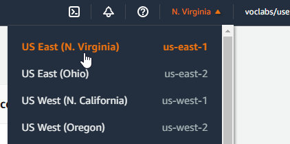

2. In the search bar at the top, type in `ec2` and click on `EC2` to go to the EC2 Dashboard
   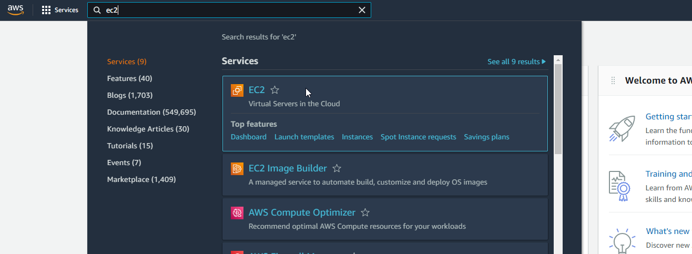
3. Click on `Launch instances`

- Step 1 - Choose an Amazon Machine Image (AMI): `Amazon Linux 2 AMI (HVM) - Kernel 5.10, SSD Volume Type`
  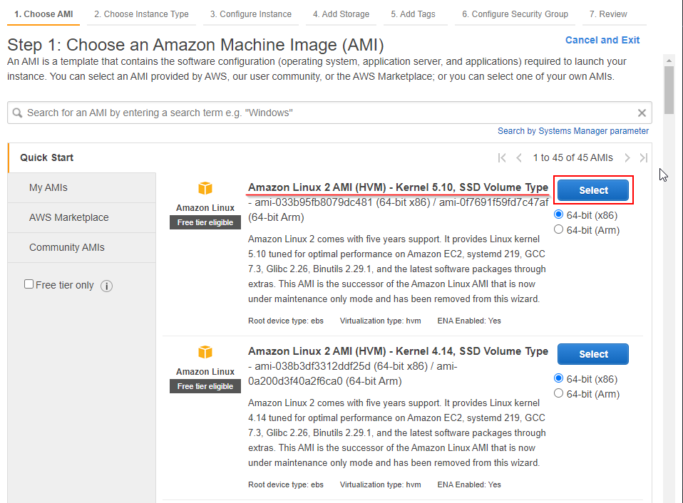
- Step 2 - Choose an Instance Type: `r5.large`
  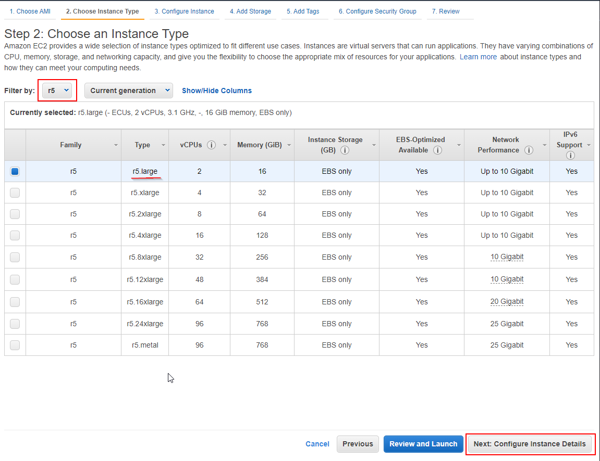
- Step 3 - Configure Instance Details:
  - IAM role: LabInstanceProfile
    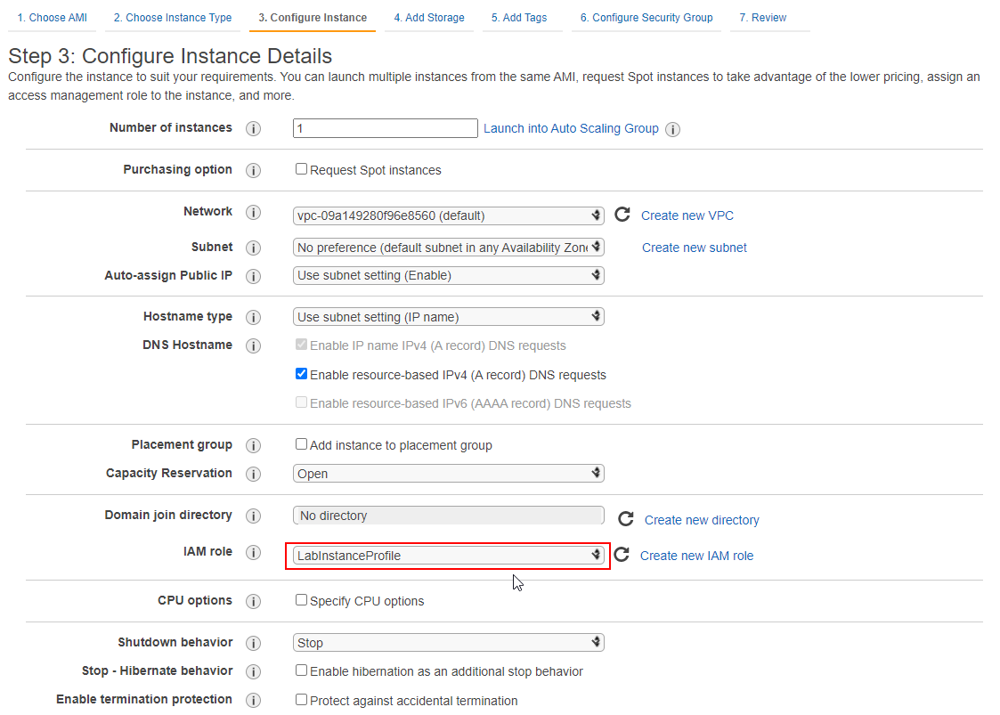
  - Copy and paste the [aws-userdata.sh](../../../../tools/aws-userdata.sh) script into the `User data` field
    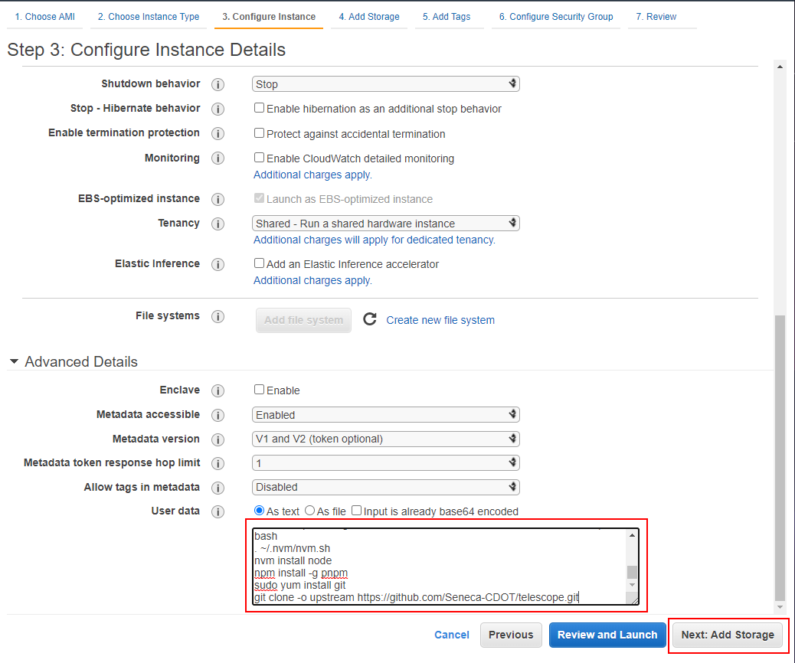
- Step 4 - Add Storage: Change the Size (GiB) from `8` to `20`
  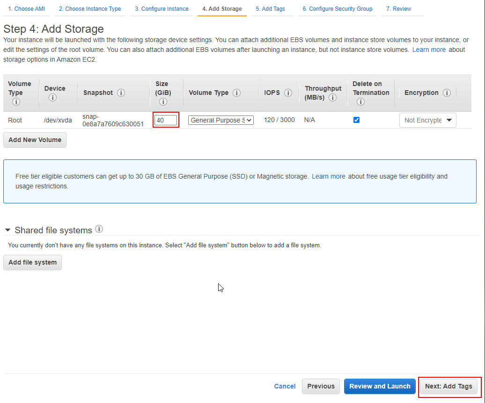
- Step 5 - Add Tags: No tags are needed. Proceed to the next step.
- Step 6 - Configure Security Group:

  - Assign a security group: `Create a new security group`
  - Security group name: `telescope-sg`
  - Add the following Rules:
    1. SSH for your IP address
    - Type: `SSH`
    - Protocol: `TCP`
    - Port Range: `22`
    - Source: `My IP` (When you select this from the dropdown menu, it will automatically put `<your-ip-address>/32` in the field. For example `76.72.29.150/32`)
    2. Open port 3000 for your IP address
    - Type: `Custom TCP`
    - Protocol: `TCP`
    - Port Range: `3000`
    - Source: `My IP`
    3. Open port 8000 for your IP address
    - Type: `Custom TCP`
    - Protocol: `TCP`
    - Port Range: `8000`
    - Source: `My IP`
    4. Open port 8000 for your IP address
    - Type: `Custom TCP`
    - Protocol: `TCP`
    - Port Range: `8443`
    - Source: `My IP`

  

  Note: `My IP` is the IP address of your (home) network. Your IP address will likely change if you manually reboot your router or a power outage occurs and your router reboots itself. If you know your IP address has changed, please update the Security Group on AWS.

4. Click on `Review and Launch`. You will get a warning: `Your instance configuration is not eligible for the free usage tier`, this is because we're using a `r5.large` instance type.
5. Click on `Launch`
6. In the pop-up, choose `Choose an existing key pair`

- Select a key pair: `vockey`

9. Click on `Launch Instances`
   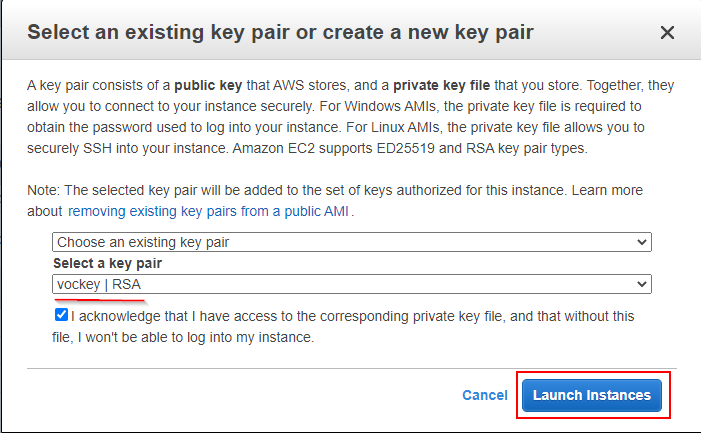

It will take a few minutes for AWS to launch your new EC2 instance.

10. Once your EC2 instance has been launched, you should name it something meaningful like `Telescope-Dev` and you can find your EC2 instance's public IPv4 address. Make note of this IP address.
    

## Associate an Elastic IP address to your EC2 instance

1. In the left-hand pane, go to `Network & Security` > `Elastic IPs`
2. Click on `Allocate Elastic IP address` button
   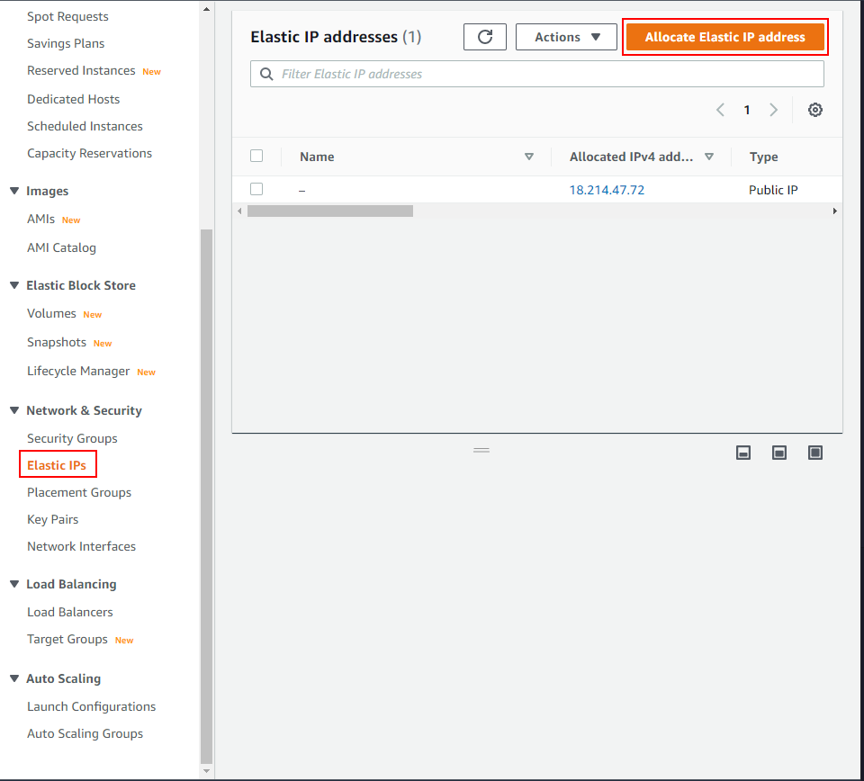

- Network Border Group: `us-east-1`
- Public IPv4 address pool: `Amazon'pool of IPv4 addresses`
  and click on `Allocate`
  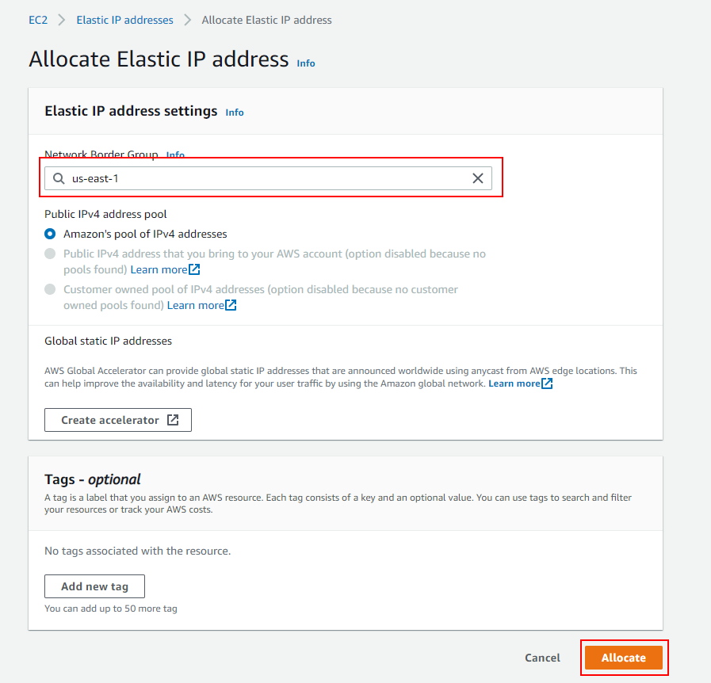

3. Select the newly created Elastic IP address. In the `Actions` dropdown menu, select Associate Elastic IP address
   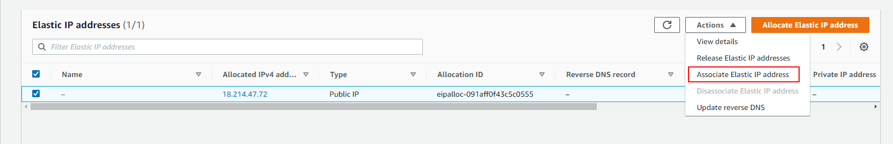
4. Select the EC2 instance you've created in the previous section `Telescope-Dev` and click on `Associate`
   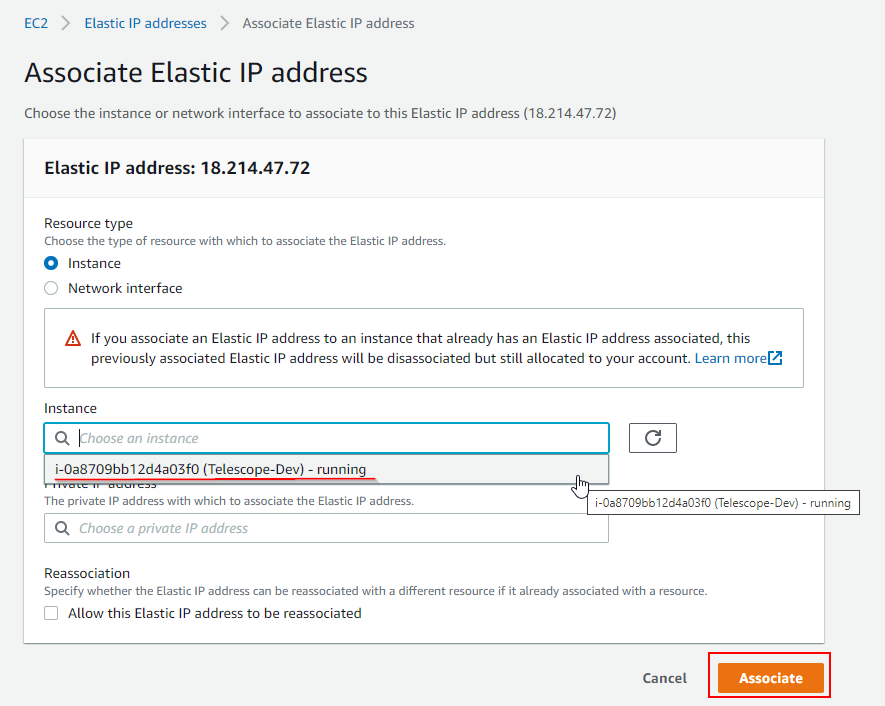
5. In the left-hand pane, go to `Instances`, select `Telescope-Dev` and you should be able to see that your Elastic IP address has been associated to your EC2 instance

## Connect using SSH

### Obtain your AWS Credentials and SSH Key

1. You can find your AWS credentials under `AWS Details` of your AWS Academy account
   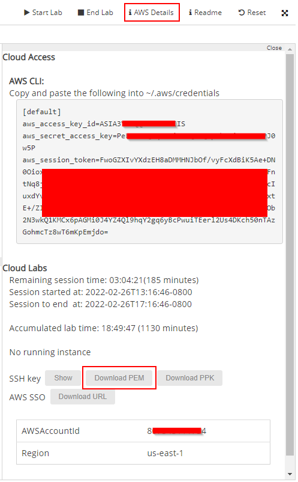
2. Download the `SSH key` (labsuser.pem) file to your local computer. Note the file location

3. Open up Visual Studio Code
4. Click on the `Open a Remote Window` icon at the bottom left-hand corner of the window
   
5. Select `Connect to Host`
   
6. Select `Configure SSH Hosts...`
   
7. This will open up a `config` file in Visual Studio Code. If you're using Windows, it'll be something like `C:/Users/cindy/.ssh/config`
   

8. Edit the `config` file with the following:

```
Host aws-e2
    HostName <your-ec2-ip-address>
    User ec2-user
    IdentityFile ~/.ssh/labsuser.pem
```

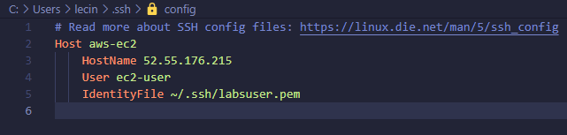

7. Save the file
8. When you click on the `Open a Remote Window` icon at the bottom left-hand corner again and choose `Connect to Host`, you will see `aws-ec2` listed.
9. Select `aws-ec2` and a new Visual Studio Code window will open.
   
10. You will see `"aws-ec2" has fingerprint "SHA256:xxx"` and `Are you sure you want to continue?`. Click on `Continue`. Then You should see that you're connected!
    
    

## Setting up your AWS credentials

1. Open up a terminal in Visual Studio Code (hotkey on Windows: `Ctrl + backtick`). You should see that you're logged in as something like `[ec2-user@ip-172-31-4-0 ~]$`.

2. Verify the AWS CLI installation

```
$ aws --version

aws-cli/2.3.0 Python/3.8.8 Linux/5.4.0-1045-aws exe/x86_64.ubuntu.20 prompt/off
```

6. Configure your AWS credentials

```
aws configure
```

7. Currently, everything is set as None so enter your credentials for your AWS IAM user.

```
AWS Access Key ID [None]: ****************764G
AWS Secret Access Key [None]: ****************qBbe
Default region name [None]: us-east-1
Default output format [None]:
```

## Verify that everything in the aws-userdata.sh script was installed correctly

1. Check Docker: `docker info`
2. Check docker-compose version: `docker-compose --version`
3. Check Node.js version: `node -v`
4. Check pnpm version: `pnpm -v`
5. Check git version: `git --version`

## Authenticate as your GitHub account with the GitHub CLI

1. Run `gh auth login`
2. What account do you want to log into? `GitHub.com`
3. What is your preferred protocol for Git operations? `SSH`
4. Generate a new SSH key to add to your GitHub account? `Yes`
5. Enter a passphase for your new SSH key (Optional): `********`
6. How would you like to authenticate GitHub CLI? `Login with a web browser`
7. First copy your one-time code: `ABC1-234D`

## Opening up the Telescope repository in AWS EC2:

1. Clone your fork of the Telescope repository. For example `gh repo clone cindyledev/telescope`. If you do not have a fork of the Telescope repository, run `gh repo clone -o upstream Seneca-CDOT/telescope` to clone the Telescope repository and name the remote `upstream` then proceed to Step 5.

```
gh repo clone <github-username>/telescope
```

2. Open the `telescope` directory and the entire Telescope files and folder structure should be visible to you!
   
   

3. Add the Telescope repository and name the remote `upstream` by entering

```
git remote add upstream https://github.com/Seneca-CDOT/telescope.git
```

4. Verify that the remote has been added

```
git remote -v
```

5. Set all the necessary environment variables in your .env file to contain your EC2 instance's public IPv4 address by executing the `aws-ip.sh` script

```
sh ./tools/aws-ip.sh
```

### If you did everything correctly, you've completed the environment setup!

## Now to get started with development...

1. Install all dependencies

```
pnpm install
```

2. Start all Telescope services using the environment variables set in `.env`. This will take some time to complete

Note: Do not use `pnpm services:start`. This will use the environment variables in `config/env.development` and we don't want that here.

```
docker-compose --env-file .env up -d
```

3. Start the Telescope development server on Port 3000

```
pnpm start
```

4. Find your EC2 instance's public IPv4

```
$ curl -s http://169.254.169.254/latest/meta-data/public-ipv4

35.174.16.133
```

5. Open `<public-ip>:8000` browser tab to see Telescope running on a AWS Cloud9 environment!

6. Open `<public-ip>:3000/feeds` in another browser tab to see all the feeds in the backend

7. Open `<public-ip>:8443/v1/<microservice-port>` in another browser tab to see the microservices. For example `35.174.16.133:8443/v1/status`


## Frequently Asked Questions (FAQ)

### How do I stop my docker containers?

```
pnpm services:stop
```

### How do I delete my docker containers?

```
docker system prune -af --volumes
```

### I can't open `<EC2-ip>:8000` running, what could I be doing wrong?

1. If you have a VPN on, turn it off and get your IP address by visiting [http://checkip.amazonaws.com/](http://checkip.amazonaws.com/) then updating your Security Group to allow your IP address to access the ports 22, 3000, 8000, and 8443.

2. Your home IP address may have changed because your router was rebooted. This can happen when you manually reboot your router or when a power outage occurs. The solution here is the same as above. You can get your IP address by visting [http://checkip.amazonaws.com/](http://checkip.amazonaws.com/) then updating your Security Group to allow your IP address to access the ports 22, 3000, 8000, and 8443.

### How do I turn off my EC2 instance if I'm actively not using it?

1. Close your Remote Connection on VS Code

2. Manually turning the EC2 instance off using the AWS Console
   

3. Stop your AWS Academy Lab
