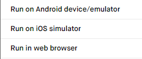
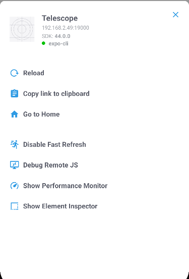

# React Native

## Installing React Native Expo

We use [Expo](https://expo.dev/) to help us develop our application. Install the command line tool so you can run Expo commands.

```
npm install -g expo-cli
```

## Running the application

Open `Metro Bundler` (deployment server) for testing and deployment purposes.

```
cd src/mobile
pnpm start
```

`Metro Bundler` gives you the chance to test our application on an `Android` simulator, `iOS` simulator, `web` or on a real device.



In `Metro Bundler`, you can choose to generate a `QR` code with the `tunnel` connection to have the app running on your physical device.


:::note

For `macOS` more [configuration](https://docs.expo.dev/workflow/android-studio-emulator/) is needed if you want to use `Android Studio` to test the application.

:::

### XCode

Testing on `iOS` requires `macOS` and [Xcode](https://developer.apple.com/xcode/). Learn how to set up [xCode](https://docs.expo.dev/workflow/ios-simulator/) properly for development.

### Android Studio

On the other hand, [Android Studio](https://developer.android.com/studio?gclid=Cj0KCQiAuvOPBhDXARIsAKzLQ8HSP0n1tojsRjsEZhT2cWmUrps8u4oND0eAONViZsf9rqMk2gFpc_waAtJOEALw_wcB&gclsrc=aw.ds) provides virtual `Android` machine for testing purposes. Learn how to set up [Android Studio](https://docs.expo.dev/workflow/android-studio-emulator/).

##### Windows Installation

1. [Download Android Studio](https://developer.android.com/studio) using the standard options.
2. Once you open up Android Studio, navigate to File > Settings.
3. Under Appearance & Behaviour, expand System Settings and select Android SDK. From here, select SDK Tools. Install one of the SDK Packages.
   
4. Before hitting apply or OK, note down the Android SDK Location.
5. Right click your Windows Icon, and select System. Under About you can see the `advanced system settings`, select Advanced and then Environment Variables(as seen below).

   

6. Create a new system variable named `ANDROID_SDK` and set the value to the path you copied in step 4.
   
7. Open up Android Studio, and select the top right icon for **Device Manager**. Select Create a device (any device will do that is Android 11+).
   
8. Click the "play" button next to the new device you just created. This will open up your virtual android device.
9. When you go back to the repository, you can now type "a" after running the Metro Bundler, which will then launch the React Native App in the emulator you just created!
   

## Debugging

To bring up the developer menu:



- On `Android` virtual machine: Cmd ⌘ + M or Ctrl + M
- On `iOS` virtual machine: Cmd ⌘ + D (on `iOS` sometimes you will have to use Ctrl + D then Cmd ⌘ + D) or Ctrl + D
- On physical devices: shake your device

Click on `debug remote JS` and then you can work on debugging the application using `Chrome developer tool`

:::note

Remember to turn off `Remote JS debugging` mode or it will slow down the application

:::
