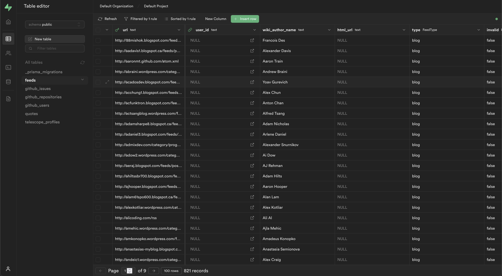

# Supabase

## What is [Supabase](https://supabase.com/docs/)

[Supabase](https://supabase.com/docs/) is an application development software that includes many backend services:

- Database: A dedicated scalable Postgres database
- Studio: A web dashboard that includes Table & SQL editors, Database management, and API documentation.
- Rest API: Auto-generated API for your database
- Realtime: Realtime subscription to database changes
- Authorization: User management with Row Revel Security

## Architecture


## Self-hosting

Unlike the [hosted platform](https://app.supabase.io/), Telescope self-hosts and manages the infrastructure where the containerized Supabase runs.

Supabase consists of many containerized images defined in [docker/supabase](https://github.com/Seneca-CDOT/telescope/tree/master/docker/supabase)

### Configuration

There are 4 important keys that help us secure our database.

- `POSTGRES_PASSWORD`: POSTGRES database password
- `ANON_KEY`: A public API key, used for interacting with the database through REST interface but restricted by RLS
- `SERVICE_ROLE_KEY`: A private admin key used on the server-side and is not restricted by RLS
- `JWT_SECRET`: JWT secret used for verifying the signature of backend-issued JWT token

### Role level security - RLS

Row-level security (RLS for short) is a PostgreSQL security feature that allows database administrators to define policies to control how specific rows of data display and operate for one or more roles.

RLS is, in essence, an additional filter you can apply to a PostgreSQL database table. When a user tries to perform an action on a table, this filter is applied before the query criteria or other filtering, and the data is narrowed or rejected according to your security policy.

You can create row-level security policies for specific commands like SELECT, INSERT, UPDATE, and DELETE, specify it for ALL commands.

#### Example

```sql
-- Enable read access for Seneca users
CREATE POLICY profiles_read_policy ON telescope_profiles
    FOR SELECT
    USING (((current_setting('request.jwt.claims'::text, true))::jsonb #> '{roles}'::text[]) ? 'seneca'::text);
```

Source: [20220406234157_enable_rls/migration.sql](https://github.com/Seneca-CDOT/telescope/blob/master/src/db/prisma/migrations/20220406234157_enable_rls/migration.sql)

In the example above, the RLS policy is written in PostgreSQL syntax. It is meant to give read access to the `telescope_profiles` table only to authenticated Seneca users. When a request comes in, either through HTTPS or using the client library, it is going to extract the request's JWT claims and check if the `roles` claim includes `Seneca`, which means an authenticated Seneca student. If `roles` claim includes `Seneca`, Postgres returns all rows users ask for, if it does not, no rows are returned.

### Interacting with the database through a restful interface

We can interact with our API directly via HTTP requests, or through the Supabase client libraries.

#### Via HTTPS

```bash
curl http://localhost/v1/supabase/rest/v1/feeds?select=*&limit=2
   -H "apiKey:<ANON_KEY>"
   -H "Content-Type: application/json"
```

#### Via client libraries

```js
const { createClient } = require('@supabase/supabase-js');
const supabase = createClient(SUPABASE_URL, ANON_KEY);

const { data: feeds, error } = await supabase.from('feeds').select('*').limit(2);
```

## Supabase Studio

Supabase studio in a web dashboard for managing your Supabase project with Table & SQL editor and API documentation.

The Studio uses the [SERVICE_ROLE_KEY](#configration) for managing the database and is not restricted by RLS. To secure the studio deployment, it is put behind an OAuth proxy that grants access to Telescope contributors only.

If you are not able to log in to the Studio, contact [@humphd](https://github.com/humphd) so he can add you to the list.

Studio on [Development](http://localhost:8910), [Staging](https://dev.supabase.telescope.cdot.systems/), [Production](https://supabase.telescope.cdot.systems/)


